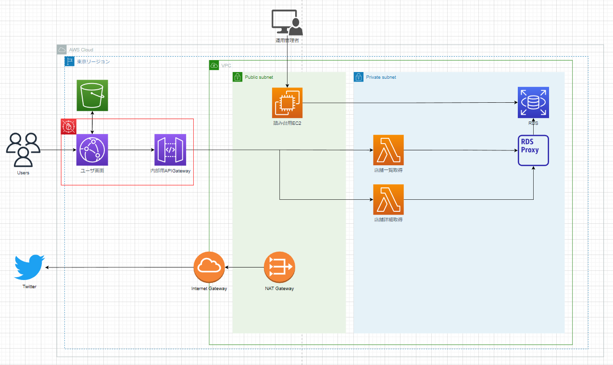

## 概要
本稿では近隣二郎検索- 提案システムのアーキテクチャを記載する。  
想定読者は開発者及び運用者とし、開発時及び運用時、システムのアーキテクチャを迅速に把握できることを目的とする。  

## アーキテクチャ
本システムはすべてAWSのリソースで構築する。  
また、アーキテクチャとしては必要最小限の機能を構築する。  
必要になった時点で新たな機能を構築し、アーキテクチャを更新する。  
現時点でのアーキテクチャを下記とする。  
